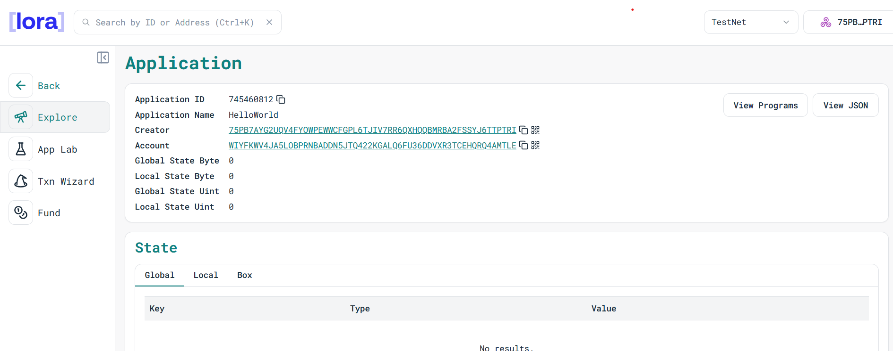

# 🎓 Student Record dApp on Algorand

A simple decentralized application (dApp) built on **Algorand** using **Algorand TypeScript SDK**.  
This project demonstrates how to create and manage a student record system directly on the blockchain.

---

## 📖 Project Description

This project showcases a beginner-friendly smart contract written in **TypeScript** for the Algorand blockchain.  
It allows you to **store and retrieve a student's name and grade** in Algorand’s **global state**, ensuring transparency, security, and immutability.

---

## ⚡ What it does

- Stores a single student’s **name** and **grade** on the blockchain.  
- Updates records seamlessly by calling the `AddRecord` method.  
- Retrieves the stored record using the `GetRecord` method.  
- Ensures that student data is securely maintained on-chain.  

---

## ✨ Features

- ✅ **Built with Algorand TypeScript** – clean and readable code  
- ✅ **Immutable & Secure** – once stored, records live on-chain  
- ✅ **Beginner Friendly** – minimal contract, great starting point for learning  
- ✅ **Extendable** – can be expanded to support multiple students using Boxes  

---

## 🔗 Deployed Smart Contract

Contract Address: **75PB7AYG2UQV4FYOWPEWWCFGPL6TJIV7RR6QXHQQBMRBA2FSSYJ6TTPTRI**  
   

---

## 🛠️ Smart Contract Code

```typescript
import { Contract, GlobalState } from '@algorandfoundation/algorand-typescript';

export class StudentRecord extends Contract {
  // Single global state key
  studentName = GlobalState<string>({ key: "studentName", initialValue: "" });
  grade = GlobalState<string>({ key: "grade", initialValue: "" });

  AddRecord(name: string, g: string): string {
    this.studentName.value = name;
    this.grade.value = g;
    return name;
  }

  GetRecord(): string {
    return `${this.studentName.value}: ${this.grade.value}`;
  }
}


```


